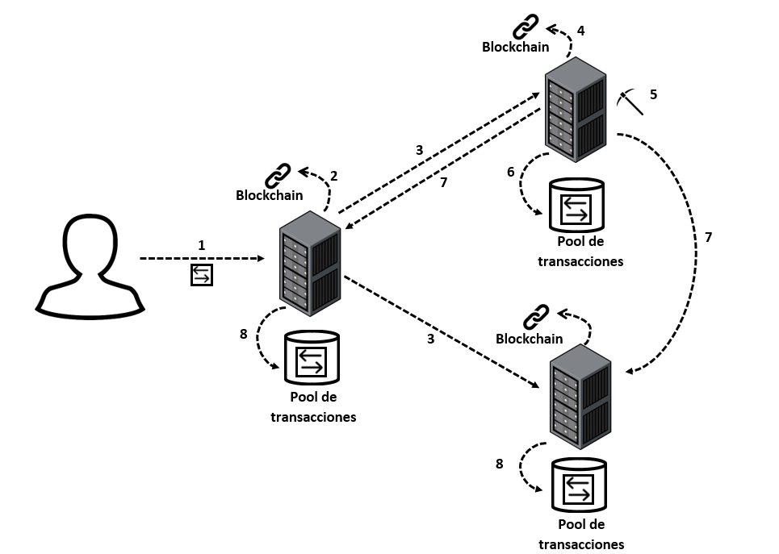

# Blockchain development in java

Inspired by [this article](https://hackernoon.com/learn-blockchains-by-building-one-117428612f46) by [Daniel van Flymen](https://github.com/dvf), where it describes how to implement a blockchain in Python.

## Developed

The blockchain developed is in the style of the Bitcoin network, its objective is to exchange value directly between users while maintaining security.

## How it works

This diagram shows the process of a transaction from its sending to its incorporation into the chain.

1. El usuario envía una transacción a un nodo de la red.
2. El nodo añade la transacción a su pool de transacciones.
3. Se propaga la transacción al resto de nodos de la red.
4. El resto de nodos añaden dicha transacción a sus pools.
5. Uno de los nodos encuentra una solución a la prueba de trabajo para minar un nuevo bloque compuesto por las transacciones en el pool.
6. Dicho nodo añade el nuevo bloque a su cadena de bloques.
7. Propaga el bloque al resto de nodos.
8. El resto de nodos verifican la validez del bloque recibido y si es válido lo añaden a sus cadenas.

## Requirements

To run this project, you will need to have the following installed:

- Java 17
- Maven

## Installation

1. Clone this repository on your local machine.
2. Navigate to the root directory of the project.